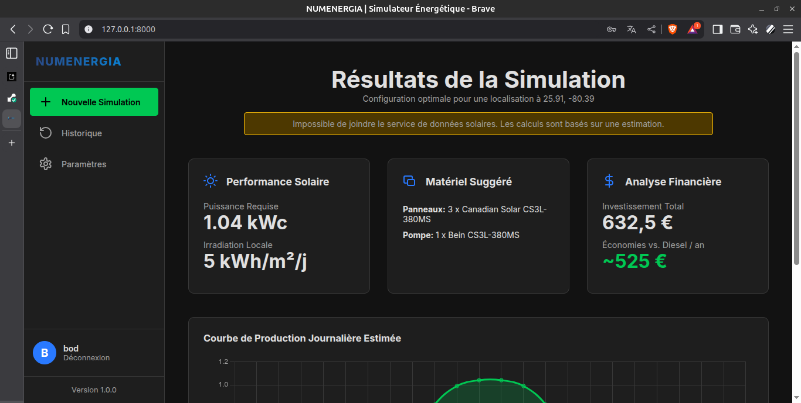

# NUMENERGIA - Simulateur Intelligent pour Projets Solaires



**NUMENERGIA** est une application web avancée conçue pour démocratiser l'accès à l'ingénierie des systèmes énergétiques renouvelables. Développée dans le cadre du hackathon **HACK for Earth**, elle vise à fournir un outil d'aide à la décision puissant et intuitif pour le dimensionnement de projets solaires, avec un focus sur les besoins des communautés rurales.


## 🎯 Problématique & Objectif

Dans de nombreuses régions, notamment en Afrique subsaharienne, l'accès à une énergie fiable et abordable reste un défi majeur qui freine le développement agricole et économique. Le déploiement de solutions solaires (pompage, électrification) est souvent entravé par la complexité technique du dimensionnement.

**NUMENERGIA a pour objectif de lever ce verrou technologique en offrant :**

*   Un **simulateur précis** basé sur des données géolocalisées et des modèles physiques.
*   Une **interface moderne et accessible** ne nécessitant aucune expertise technique préalable.
*   Des **recommandations intelligentes** adaptées aux contraintes (budget, performance) de l'utilisateur.
*   Des **analyses financières** claires pour évaluer la rentabilité d'un projet.
*   Un **outil de gestion de projets personnels** grâce à des comptes utilisateurs et un historique des simulations.


## ✨ Fonctionnalités Clés

*   **Simulation de Pompage Solaire :** Calculez la puissance photovoltaïque (kWc) nécessaire en fonction de vos besoins en eau et de votre localisation.
*   **Scénarios d'Optimisation :** Choisissez entre une configuration optimisée pour le **Budget** (coût minimal) ou la **Performance** (fiabilité et marge de sécurité).
*   **Dimensionnement de Batteries :** Évaluez le parc de batteries nécessaire pour assurer plusieurs jours d'autonomie énergétique.
*   **Base de Données de Composants :** Obtenez des recommandations de matériel concret (panneaux, pompes, batteries) basées sur une base de données interne.
*   **Analyse Financière :** Estimez l'investissement total, le coût actualisé de l'énergie (LCOE) et les économies annuelles par rapport à une solution diesel.
*   **Visualisation de Données :** Un graphique interactif vous montre la courbe de production solaire estimée sur une journée type.
*   **Comptes Utilisateurs & Historique :** Créez un compte, sauvegardez automatiquement toutes vos simulations et consultez-les à tout moment.
*   **Rapports PDF Professionnels :** Générez et téléchargez un rapport technique et financier complet de chaque simulation.


## 🛠️ Stack Technologique

*   **Backend :** [Django](https://www.djangoproject.com/)
*   **Frontend :** HTML5, CSS3, JavaScript (Vanilla JS)
*   **Base de Données :** SQLite (en développement), PostgreSQL (en production)
*   **Génération de PDF :** [WeasyPrint](https://weasyprint.org/)
*   **Cartographie :** [Leaflet.js](https://leafletjs.com/)
*   **Graphiques :** [Chart.js](https://www.chartjs.org/)
*   **Données Solaires :** API [PVGIS](https://re.jrc.ec.europa.eu/pvg_tools/en/) de la Commission Européenne


## 🚀 Installation et Lancement

### Prérequis

*   Python (3.9+ recommandé)
*   Un gestionnaire d'environnement (comme `venv` ou `conda`)

### Instructions

1.  **Clonez le dépôt :**
    ```bash
    git clone https://github.com/ShegouB/numenergia.git
    cd numenergia
    ```

2.  **Créez et activez un environnement virtuel :**
    *Avec `venv` :*
    ```bash
    python -m venv venv
    source venv/bin/activate  # Sur Windows: venv\Scripts\activate
    ```
    *Avec `conda` :*
    ```bash
    conda create --name numenergia python=3.9
    conda activate numenergia
    ```

3.  **Installez les dépendances Python :**
    ```bash
    pip install -r requirements.txt
    ```


4.  **Installez les dépendances système pour WeasyPrint (PDF) :**
    *Sur Debian/Ubuntu :*
    ```bash
    sudo apt-get install libpango-1.0-0 libcairo2
    ```
    *Sur MacOS :*
    ```bash
    brew install pango cairo
    ```

5.  **Appliquez les migrations de la base de données :**
    ```bash
    python manage.py migrate
    ```

6.  **Créez un superutilisateur pour accéder à l'interface d'administration :**
    ```bash
    python manage.py createsuperuser
    ```
    *Suivez les instructions pour créer votre compte admin.*

7.  **(Important) Remplissez la base de données :**
    *   Lancez le serveur : `python manage.py runserver`
    *   Allez sur `http://127.0.0.1:8000/admin` et connectez-vous.
    *   Ajoutez au moins une instance pour chaque modèle : **Financial Assumptions**, **Solar Panel**, **Water Pump**, et **Battery**. L'application ne fonctionnera pas sans ces données.

8.  **Lancez le serveur de développement :**
    ```bash
    python manage.py runserver
    ```
    L'application sera accessible à l'adresse `http://127.0.0.1:8000`.

---

## 🔮 Feuille de Route et Évolutions Futures

*   **Axe 1 : Intelligence Accrue**
    *   [ ] Intégrer des profils de consommation d'énergie plus complexes (pas seulement le pompage).
    *   [ ] Développer des algorithmes d'optimisation plus avancés (ex: `scipy.optimize`).
*   **Axe 2 : Expérience Utilisateur**
    *   [ ] Implémenter le partage de projets entre utilisateurs.
    *   [ ] Créer un tableau de bord personnalisé pour chaque utilisateur.
*   **Axe 3 : Données & Fiabilité**
    *   [ ] Ajouter des tests automatisés pour valider la justesse des calculs.
    *   [ ] Mettre en place un système de cache pour les appels aux API externes.

---

## 🙏 Remerciements

Ce projet a été développé dans le cadre du hackathon **HACK for Earth** organisé par l'**ENSGMM** (UNSTIM, Bénin). Un grand merci aux organisateurs et aux mentors pour leur soutien.